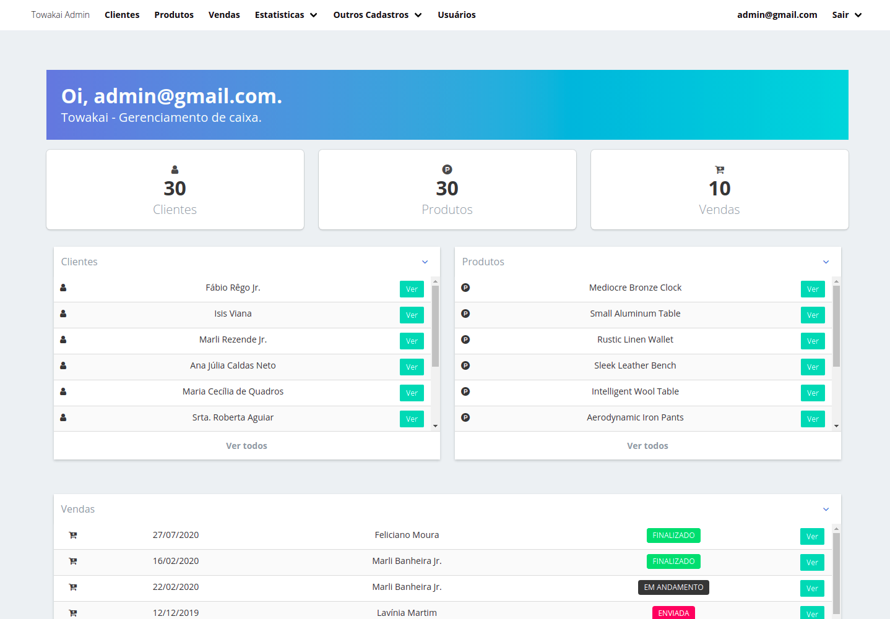

# README

Este projeto foi feito para controlar as vendas e os clientes de uma loja, assim como lucros e afins, ele possui gráficos e métricas que podem lhe ajudar a controlar sua loja.



## Instalação

Windows & Linux:

```sh
git clone or download the project

```
* rode rails db:create para criar o banco de dados
* rode rails db:migrate para criar as migrações
* rode rails db:seed para popular o banco com alguns dados

## Tecnologias Usadas

*  Ruby on Rails
*  Bulma front end Framework
*  Font awesome
*  Várias Gems, entre elas(Devise, ransack, cancancan, kaminari e etc..)


## Contato

Nelcifran Magalhaes – [@Linkedin](https://www.linkedin.com/in/nelcifranpires/
) – nelcifranpires@gmail.com